# Insertion Sort Projesi
## Proje 1
**[22,27,16,2,18,6]** -> Insertion Sort

- Yukarı verilen dizinin sort türüne göre aşamalarını yazınız.
- **Big-O** gösterimini yazınız.
- Time Complexity: Average case: Aradığımız sayının ortada olması,Worst case: Aradığımız sayının sonda olması, Best case: Aradığımız sayının dizinin en başında olması.
- Dizi sıralandıktan sonra 18 sayısı hangi case kapsamına girer? Yazınız.

**[7,3,5,8,2,9,4,15,6]** dizisinin Insertion Sort'a göre ilk 4 adımını yazınız.

**[22,27,16,2,18,6]** 
```javascript
const insertionSort = (arr) =>{
    for (let i = 1; i < arr.length; i++) {
        let temp = arr[i];
        let j = i-1; 
        while (j>=0 && arr[j]>temp) {
            arr[j+1] = arr[j];
            j--;
        }
        arr[j+1]=temp;
        console.log(arr);
    }
}
```
- Öncelikle `for` döngüsü oluşturur ve gezinme işlemi **2. değerden** başlayarak dizinin boyutu kadar dizi içinde gezilir. 2. sıradan başlamasının sebebi `for` döngüsünde her çevrimde `i` değeri bir önceki `i` değeri ile karşılaştırılır.
- Döngünün içine mevcut çevrimde `i` değerimizi tutacak `temp` ve bir önceki değeri tutacak `j` değişkenleri tanımlanır.
- `While` döngüsü kullanılarak eğer `j` **0**'dan büyükse ve  `arr[j]` **>** `temp` den büyükse döngünün içine girer ve `arr[j+1]`'e `arr[j]` değerini tanımlar. Daha sonra `j`' değerini azaltır. `j`'yi azaltmasının ilk sırada en küçük değerin olması için o anki değeri geriye doğru kontrol ederek taşır.
- Son olarak `temp`'deki değeri `arr[j+1]`'e atar.

```javascript
insertionSort([22,27,16,18,6])
```
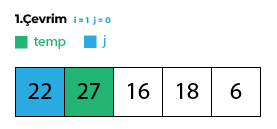
- **İlk çevrimde** `arr[1] = 27` dolayısıyla  `temp = 27` `j` ise `i-1` olduğu için `j=0 = arr[0]` ve değeride **22**, `while`'ın ilk koşulu **0**'dan büyük eşitse sağlanıyor ama **22 27**'den büyük olmadığı için `while` döngüsüne girilmiyor.
  
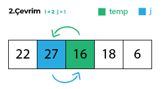
- **2.çevrimde** `arr[2] = 16` dolayısıyla  `temp = 16` `j` ise `i-1` olduğu için `j=1 = arr[1]` ve değeride **27**, `while`'ın ilk koşulu **0'dan büyük eşitse** sağlanıyor **22 16**'dan büyük olduğu içinde koşullar sağlandığı için `while` döngüsüne giriliyor ve **27 ile 16**'nın yeri değişiyor daha sonra `j` **1** azaltılıyor ve değeri  `j=0` oluyor.

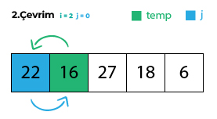
- `j=0` olduğu için ve **22** **16**'dan büyük olduğu için `while` döngümüz tekrar çalışıyor ve **22** ile **16** yer değiştiriyor. Artık `j`'nin değeri **-1** olduğu için `while` döngüsüne girilmiyor. Son olarak `arr[j+1]` yani `arr[0]`'a `temp`(16) atanıyor.

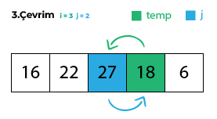
- **3.çevrimde** `arr[3] = 18` dolayısıyla  `temp = 18` `j` ise `i-1` olduğu için `j=2 = arr[2]` ve değeride **27**, `while`'ın ilk koşulu **0**'dan büyük eşitse sağlanıyor **27** **18**'dan büyük olduğu içinde koşullar sağlandığı için `while` döngüsüne giriliyor ve 27 ile 18'in yeri değişiyor daha sonra `j` **1** azaltılıyor ve değeri  `j=1` oluyor.
  
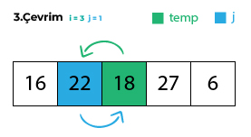
- `j=1` olduğu için `while` döngüsü tekrar çalışıyor. ve `arr[1]>temp` yani **22** büyükse **18**'den koşuluda sağlandığı için **22** ile **18**'in yerleri değişiyor ve `j`'nin değeri 1 azaltılıyor ve  `j=0` oluyor.

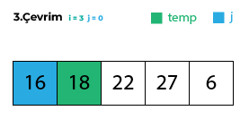
- `j=0` olduğu için `while` döngüsü tekrar çalışıyor. ve `arr[0]>t`emp yani `'den koşulu sağlanmadığı için `while` döngüsü artık çalışmıyor ve temp değerimiz yani ` `arr[j+1]`'e yani `j` ` olduğu için `arr[1]'e` atanıyor ve ve 3. çevrim sonlanıyor.

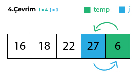
- **4.çevrimde** `arr[4] = 6` dolayısıyla  `temp = 6` `j` ise `i-1` olduğu için `j=3 = arr[3]` ve değeride **27**, `while`'ın ilk koşulu **0**'dan büyük eşitse sağlanıyor **27** **6**'dan büyük olduğu içinde koşullar sağlandığı için `while` döngüsüne giriliyor ve **27** ile **6**'nın yeri değişiyor daha sonra `j` **1** azaltılıyor ve değeri `j=2` oluyor.
  
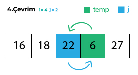
- `j=2` olduğu için `while` döngüsü tekrar çalışıyor. ve `arr[2]>temp` yani **22** büyükse **6**'dan koşuluda sağlandığı için **22** ile **6**'nın yerleri değişiyor ve `j`'nin değeri **1** azaltılıyor ve `j=1` oluyor.

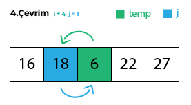
- `j=1` olduğu için `while` döngüsü tekrar çalışıyor. ve `arr[1]>temp` yani **18** büyükse **6**'dan koşuluda sağlandığı için **18** ile **6**'nın yerleri değişiyor ve `j`'nin değeri **1** azaltılıyor ve `j=0` oluyor.

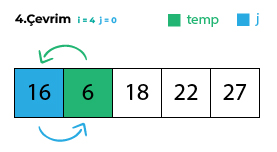
- `j=0` olduğu için `while` döngüsü tekrar çalışıyor. ve `arr[0]>temp` yani **16** büyükse **6**'dan koşuluda sağlandığı için **16** ile **6**'nın yerleri değişiyor ve `j`'nin değeri **1** azaltılıyor ve `j=-1` oluyor ve **4.çevrimde** tammalanarak sıralama işlemimiz bitmiş oluyor. Artık listemiz aşağıdaki gibi sıralı.

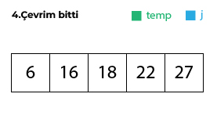

## Big-O Gösterimi
**[22,27,16,2,18,6]** -> **O(n²)** Sırasız bir dizi olduğu için 2 çevrim gerçekleşir.

- Average case: **O(n²)**
- Worst case: **O(n²)** 
- Best case: **O(n)** Sıralı bir dizi olduğunda tek çevrimde tamamlanır.
- Dizi sıralandıktan sonra 18 sayısı **Worst case** kapsamına girer.

## [7,3,5,8,2,9,4,15,6] dizisinin Insertion Sort'a göre ilk 4 adımını yazınız.
```javascript
insertionSort([7,3,5,8,2,9,4,15,6])
```

- **İlk çevrimde** `arr[1] = 3` dolayısıyla  `temp = 3` `j` ise `i-1` olduğu için `j=0 = arr[0]` ve değeride **7**, `while`'ın ilk koşulu **0**'dan büyük eşitse sağlanıyor ve **7 3**'den büyük olduğu için `while` döngüsüne giriyor ve **3** ile **7** yer değiştiriyor. **j** bir azaltılıyor ve -1 olduğu için while döngüsüne girilmiyor ve 2. çevrime geçiliyor.
**[3,7,5,8,2,9,4,15,6]**
 
- **2.çevrimde** `arr[2] = 5` dolayısıyla  `temp = 5` `j` ise `i-1` olduğu için `j=1 = arr[1]` ve değeride **7**, `while`'ın ilk koşulu **0'dan büyük eşitse** sağlanıyor **7 5**'den büyük olduğu içinde koşullar sağlandığı için `while` döngüsüne giriliyor ve **7 ile 5**'in yeri değişiyor daha sonra `j` **1** azaltılıyor ve değeri  `j=0` oluyor.
**[3,5,7,8,2,9,4,15,6]**

- `j=0` olduğu için ve **3** **5**'den büyük olmadığı için `while` döngüsüne girilmiyor ve 3. çevirme geçiliyor.

- **3.çevrimde** `arr[3] = 8` dolayısıyla  `temp = 8` `j` ise `i-1` olduğu için `j=2 = arr[2]` ve değeride **7**, `while`'ın ilk koşulu **0**'dan büyük eşitse sağlanıyor **7** **8**'den büyük olmadığı için `while` döngüsünde çıkılıyor.
**[3,5,7,8,2,9,4,15,6]**

- **4.çevrimde** `arr[4] = 2` dolayısıyla  `temp = 2` `j` ise `i-1` olduğu için `j=3 = arr[3]` ve değeride **8**, `while`'ın ilk koşulu **0**'dan büyük eşitse sağlanıyor **2** **8**'den büyük olduğu için `while` döngüsünde giriliyor ve **2** ile **8** yer değiştiriyor ve j 1 azaltılıyor.
**[3,5,7,2,8,9,4,15,6]**

- `j=2` olduğu için `while` döngüsü 2'yi en başa alana kadar  tekrar çalışıyor.
**[2,3,5,7,8,9,4,15,6]**